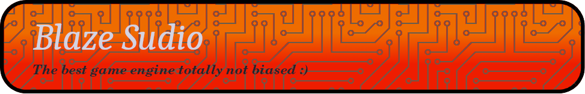

[]()

<p style="color: grey" align="center"><i>A game engine for Python lovers! ❤️</i></p>

[](https://tsunami014.gitbook.io/blaze-sudios/)
[](https://tsunami014.github.io/Blaze-Sudio/)
[](https://pypi.org/project/Blaze-Sudio/)
[](https://github.com/Tsunami014/Blaze-Sudio/actions/workflows/build.yml)
[](https://github.com/Tsunami014/Blaze-Sudio/actions/workflows/python-publish.yml)
[]()
[]()
[](https://github.com/Tsunami014/Blaze-Sudio/releases/tag/v3.0.0)

#  CURRENT VERSION: v3.0.1 (🌿 Kindle)

<!-- // TODO: Get a better icon (and put it in the banner) -->

## 🗂️ Table of contents
| [🔝 Top](#) |
| :------: |
| [🚀 About](#-about) |
| [💡 Things to note](#-things-to-note) |
| [🛠️ Installation](#️-installation) |
| [📚 Library usage (Demos)](#-library-usage-demos) |
| [💻️ The terminal script](#️-the-terminal-script) |
| [🗨️ Contributing](#️-contributing) |
| [🔜 Next versions](#-next-versions) |
| [⭐️ Star History](#️-star-history) |

The docs are in progress. If you are working offline, you can look in <!-- Pypi ignore -->[the docs folder of *this* repo (not the built package)](docs/SUMMARY.md) or if you're online, <!-- End Pypi ignore -->[https://tsunami014.gitbook.io/blaze-sudios](https://tsunami014.gitbook.io/blaze-sudios)

# 🚀 About
Blaze Sudio is an open source graphical game creation software.

Thanks to the one and only `@Imzafish` for the name! (Yes, it was originally a typo I decided to incorperate into the idea.)

Also known as:
 - The putgamecreatorsoutofbusinessanator (Thanks to `@Faunder.real` for that one)
 - One piece of code to rule them all!

# 💡 Things to note
[](https://github.com/Tsunami014/Blaze-Sudio/commits/)
[](https://github.com/Tsunami014/Blaze-Sudio/releases)
[](https://github.com/Tsunami014/Blaze-Sudio/issues)
[](https://github.com/Tsunami014/Blaze-Sudio/graphs/contributors)

[](https://github.com/Tsunami014/Blaze-Sudio/commit/c90beeb2d2e290ffff4e5fb9d112453840883ea7)
<small>(But back then it was called AIHub, now that's a different thing; if you want to compare to something compare to when v3.0.0 was released)</small>

[](https://github.com/Tsunami014/Blaze-Sudio/releases/tag/v3.0.0)

This is a very early version, and there are many things that are not yet implemented. Please be patient, and if you want to help, please do! PRs are welcome!

This project comes with 3 python libraries built into it; [pyguix](https://github.com/DarthData410/PyGames-pyguix) (I don't know whether I still need this or not...), [Pyldtk](https://github.com/LGgameLAB/pyLdtk) and [textboxify](https://github.com/hnrkcode/TextBoxify/tree/master). For pyLDtk, this is because I have edited it so much it barely resembles the original library (slight exaggeration, but still). And for the others, it was for similar reasons (and also installation problems and other things too)

# 📔 How to use
## 🛠️ Installation
Are you ready? This is the most complicated installation process of any python library that exists ever, even Tensorflow (yes, I know!) But, follow the instructions and you'll probably be ok. Remember to [join the discord server](https://discord.gg/xr3phyEZtv) if you need any help.

1. Run `pip install Blaze-Sudio`
2. Rejoice in happiness as your library gets installed, pain-free

<small>Disclaimer: may not actually be pain-free.<br>Disclaimer of the disclaimer: I'll help you if you run into any issues via [github issues](https://github.com/Tsunami014/Blaze-Sudio/issues/new/choose) or [Discord](https://discord.gg/xr3phyEZtv), so it will be mostly pain-free (for you) as a satisfaction guarantee</small>

### ⛏️ Installing from source
```bash
git clone https://github.com/Tsunami014/Blaze-Sudio.git
cd Blaze-Sudio
pip install .
```
## 📚 Library usage (Demos)
A simple demo is kinda hard because you need an ldtk file to make the levels with, but in this repo you can find some demo games, and //TODO: one day I'll make a repo with a whole bunch of JUST sample games and link it here.
But, the docs for making a game would be helpful, and are here: <!-- Pypi ignore -->[Offfine 🖥️](docs/game/README.md) / <!-- End Pypi ignore -->[Online 🌐](https://tsunami014.gitbook.io/blaze-sudios/main-functionality/game)

And if you want full, in-depth explanation of each thing Blaze Sudio has to offer and how to use it all, visit [the docs](https://tsunami014.gitbook.io/blaze-sudios/)!

But if you want to see the kind of code that is created, well, here is an example:
<details>
    <summary>Click to see the code</summary>

<!-- TODO: Remember to always update this whenever something major changes -->
```python
from BlazeSudio.Game import Game
from BlazeSudio.collisions import collisions
import BlazeSudio.Game.statics as Ss
import pygame

G = Game()
G.load_map("./world.ldtk")

class BaseEntity(Ss.BaseEntity):
    def __init__(self, Game, e):
        super().__init__(Game, e)
        self.accel_amnt = [[0.2, 0.2], [0.05, 0.05]]
        self.gravity = [0, 0.1]
    
    def __call__(self, evs):
        self.handle_keys()
        self.handle_accel()
        colls = self.Game.currentLvl.layers[1].intgrid.getRects(1)
        self.pos = [self.pos[0]-0.45, self.pos[1]-0.45]
        outRect, self.accel = collisions.Rect(self.scaled_pos[0], self.scaled_pos[1], self.entity.gridSze*0.9, self.entity.gridSze*0.9).handleCollisionsAccel(self.accel, colls, False)
        outUnscaled = self.entity.unscale_pos((outRect.x, outRect.y))
        outUnscaled = [outUnscaled[0]+0.45, outUnscaled[1]+0.45]
        self.pos = outUnscaled
    
    @property
    def scaled_pos(self):
        return self.entity.scale_pos(self.pos)

@G.DefaultSceneLoader
class MainGameScene(Ss.BaseScene):
    DefaultEntity = []
    def __init__(self, Game, **settings):
        self.lvl = settings.get('lvl', 0) # This before because it loads the bounds in the super() and it needs the level
        super().__init__(Game, **settings)
        self.sur = None
        self.CamDist = 8
        for e in self.currentLvl.entities:
            if e.defUid == 107:
                self.entities.append(BaseEntity(self, e)) # The Player
                self.DefaultEntity.append(e)
                self.entities[0].pos = [e.UnscaledPos[0]+0.5, e.UnscaledPos[1]+0.5]
                break
        else:
            raise Ss.IncorrectLevelError(
                'Need a player start!'
            )
    
    @property
    def CamPos(self):
        return self.entities[0].scaled_pos

    def render(self):
        if self.sur is not None:
            return self.sur
        self.sur = self.Game.world.get_pygame(self.lvl)
        return self.sur
    
    def renderUI(self, win, offset, midp, scale):
        playersze = scale*self.entities[0].entity.gridSze
        pos = self.entities[0].scaled_pos
        r = (pos[0]*scale+offset[0]-(playersze//2), pos[1]*scale+offset[1]-(playersze//2), playersze, playersze)
        pygame.draw.rect(win, (0, 0, 0), r, border_radius=2)
        pygame.draw.rect(win, (255, 255, 255), r, width=5, border_radius=2)

G.load_scene()

G.play(debug=False)
```

This code is a modified version of `Basic-1`, which is playable and is contained inside this repo. It was modified to remove the changing level script (an extra 2 functions) for simplicity and also to remove other things it didn't need (like the debug functions) but still does virtually the exact same thing.
<br>
</details>

**BUT DON'T WORRY** as making a game is super easy with the help of the documentation, no matter how hard you think this may look. It is all explained there.

## 💻️ The terminal script
If you have installed BlazeSudio into your global pip, you *should* be able to run the `BlazeSudio` command in your terminal. This is a script to really quickly make a new project or open the docs. you can run with `BlazeSudio --help` to see all the options.

# 🗨️ Contributing
If you would like to report a bug, security vulnerability, request a feature, etc. then [make a new issue about it](https://github.com/Tsunami014/Blaze-Sudio/issues/new/choose). If you know how to code, you can fork this repo and make a PR!

Please join our Discord server here <small>(I need friends)</small>: [](https://discord.gg/xr3phyEZtv) for any information, queries, bugs, conversations, etc. that you may have! Alternatively (as said before), you can post bug reports/ideas in the [Github issues](https://github.com/Tsunami014/Blaze-Sudio/issues/new/choose).

Just modifying whitespace or anything else that doesn't actually do anything won't be accepted (but if it's a spelling miss-steak or a broken link or something then you can tell me about it on [Discord](https://discord.com/invite/xr3phyEZtv).)

And if you want more version compatability, please *ask on Discord* as that requires changing the 'auto' build script, and I don't want to do that unless I have to (I feel bad enough taking 6 different computers up every time I want to build the collisions module).

And no, building it yourself and PR'ing that is not going to work. If I change the module it will be painful attempting to recompile the module into a version I don't have myself.

But if you're confused please ask on Discord, and thanks for any help making Blaze Sudios even better!!

# 🔜 [Next versions](progress.md)
 - v4.0.0 - ♨️`Smolder` - Pretty cool so far and have ability to make an OK game that one could submit for a competition or something. (WINGS OF FIRE REFERENCE)
 - v5.0.0 - 🌋`Fire` - cos by then it'll be on fire :grin: many cool things and stuff to make good looking games that are super cool and would totally win a competition!
 - v6.0.0 - ❤️‍🔥`Bonfire` - Who knows 🤷
 - v7.0.0 - ☄️`Inferno` - 🤷
 - v8.0.0 - 🍂`Firestorm`- What happens at this stage is a question for tommorow.

# ⭐️ Star History
(This is Going to be the funnyest thing to look at until I actually get this going really well)

[](https://star-history.com/#Tsunami014/Blaze-Sudio&Timeline)

